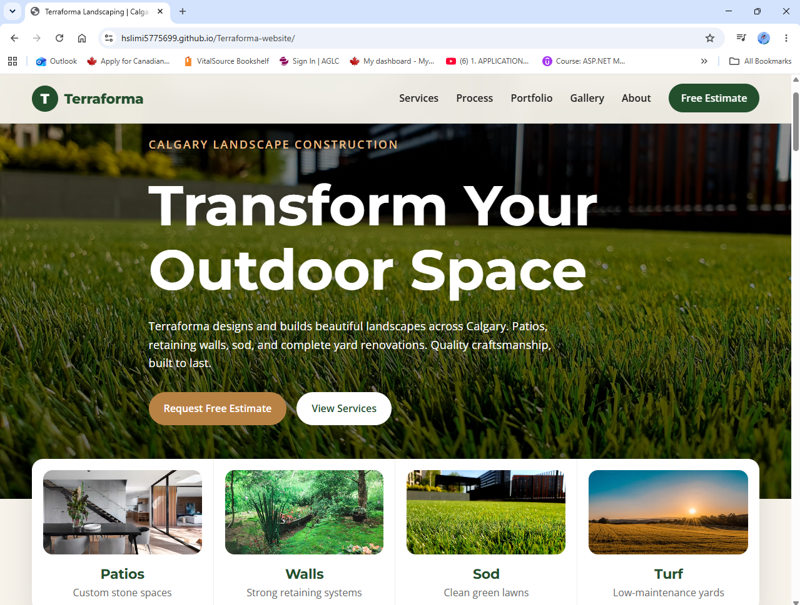

# 🌿 Terraforma – Landscaping Business Website

A modern, responsive landscaping website designed and developed to showcase professional outdoor construction and landscaping services in Calgary, Alberta.

## 📋 Project Overview

Terraforma is a front-end web project built to demonstrate my ability to create real-world business websites using clean code, responsive layouts, and modern UI design principles.

The website includes:

* Responsive navigation menu
* Hero landing section
* Services showcase
* Company information section
* Portfolio and gallery
* Project process section
* Contact form for customer inquiries
* Mobile-friendly design

## 🛠️ Technologies Used

* HTML
* CSS
* JavaScript

## 🎯 Project Goals

* Build a professional business website from scratch.
* Practice semantic HTML and responsive design.
* Improve front-end development skills and code organization.
* Create a real-world portfolio project that demonstrates practical web development experience.

## 🚀 Features

✔ Responsive Design
✔ Modern User Interface
✔ Clean and Structured Code
✔ Business Landing Page
✔ Contact Form
✔ Portfolio & Gallery Sections

## 🌐 Live Demo

View the live website here: https://hslimi5775699.github.io/Terraforma-website/

## 📸 Screenshots

## 🔄 Current Status

This project is actively being developed. Additional features and improvements will be added, including:

* Form validation
* Performance optimization
* Accessibility improvements
* Enhanced animations and interactions
* Backend integration for contact requests

## 👨‍💻 Developer

**Hamdi Slimi**
Junior Web Developer | Front-End Developer
Calgary, Alberta, Canada

📧 Email: [slimihamdi1234@gmail.com](mailto:slimihamdi1234@gmail.com)
🔗 LinkedIn: Add your LinkedIn profile here
💻 GitHub: https://github.com/hslimi5775699

